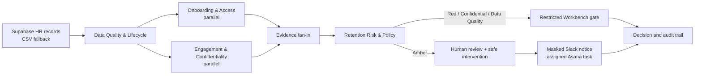

# Day90 Guardian Command Center

Governed HR & People Ops AI employee for the Autopilot Asia Hackathon.

Day90 Guardian helps People Ops teams catch onboarding, access, compliance, payroll, manager-follow-up, and engagement risks before they become retention problems. It is not just a dashboard: it is a governed command center with policy gates, human review queues, an audit trail, and live handoffs to Slack and Asana.

> **One AI employee, not five disconnected automations.** Day90 Guardian validates evidence, coordinates specialist operators, applies an explicit policy, and keeps a human accountable for any consequential action.

## What problem it solves

The first 90 days of employment are noisy. HR data is spread across onboarding tasks, access provisioning, compliance records, payroll checks, manager follow-ups, learning milestones, and engagement signals. Humans usually discover problems late because each system only shows one slice of the truth.

Day90 Guardian combines those signals into one governed workflow:

1. Validate whether the employee data is safe and complete enough to use.
2. Reconcile onboarding tasks with access/provisioning evidence.
3. Separate confidential engagement signals from normal reporting.
4. Apply editable People Ops policies to route each case.
5. Create safe human-review actions only when the case is allowed to leave the command center.

## Why this is different

Most HR dashboards report a problem after it has already been noticed. Day90 Guardian creates an accountable operating loop:

**evidence → specialist checks → policy decision → human approval → masked action → auditable outcome**

That distinction matters for People Ops. A missing laptop can be remediated; a confidential disclosure must be protected; an incomplete manager relationship means the system should stop and ask for better data rather than make a confident-looking decision.

## Core product surfaces

- **Dashboard** — executive command view of cohort health, route counts, operator flow, integrations, and audit trail.
- **Workbench** — human review queue for Amber, Red, Confidential, and Data Quality cases.
- **AI Policies** — editable governance layer that determines how cases route.
- **AI Insights** — generated operational patterns, bottlenecks, anomalies, and recommended actions.
- **Data Manager** — transparent source registry showing data lineage, connected systems, source tables, and computed signals.
- **AI Manager** — conversational control layer for asking about the system, policies, confidential handling, and operational status.

## AI employee architecture

Day90 Guardian is modeled as one orchestrated AI employee made from specialized operators:

| Operator | Responsibility |
| --- | --- |
| HR Data Quality and Lifecycle Operator | Validates worker cohort, lifecycle stage, manager references, location, and source completeness before decisions run. |
| Onboarding Task and Access Reconciliation Operator | Compares onboarding task status with laptop, badge, VPN, email, and system access evidence. |
| Engagement and Confidentiality Guard Operator | Reads engagement/non-response signals and isolates confidential disclosures from normal reporting. |
| Retention Risk and Policy Evaluation Operator | Applies Day90 policy rules and routes cases into Green, Amber, Red, Confidential, or Data Quality. |
| Intervention Execution and Outcome Operator | Creates only safe or approved Slack/Asana interventions and records external proof. |

The backend exposes the orchestration through FastAPI endpoints; the frontend renders the command center in Next.js.



The same coordination is visible in the saved Supervity workflow: two specialist branches run in parallel, merge at fan-in, then follow the policy-selected route.

## Data model

The system computes signals from HR source tables including:

- Workers
- Onboarding tasks
- Provisioning/access records
- Engagement records
- Manager directory
- Locations/entities
- Compliance items
- Payroll records
- Learning milestones
- Attrition history context
- Cross-team dependencies

The app reports this as 11/11 operational HR tables loaded. The 17 cohort count
is shown separately because it is derived from Workers, not a separate source
table. The source workbook's Field Dictionary is treated as a semantic reference
for the table fields, not as an operational table.

Primary source is Supabase when configured. The mounted CSV dataset is retained as a controlled local fallback.

## Governance and privacy rules

Day90 Guardian intentionally avoids unsafe automation:

- Confidential pulse text is not displayed in dashboard, insights, Slack messages, or public Asana task descriptions.
- Red and Confidential cases require human review before broad external action.
- Unsafe joins, missing manager ownership, and chronology problems route to Data Quality instead of being auto-resolved.
- Retention impact is framed as leading-risk reduction, not as a measured attrition outcome claim.
- External Slack/Asana actions include masked case keys and safe summaries only.

| Route | What the system does | External visibility |
| --- | --- | --- |
| Green | Records a safe outcome; no intervention is needed. | None |
| Amber | Presents a reviewer decision; an approval can create a masked Slack notification and assigned Asana task. | Safe, reviewable summary only |
| Red | Keeps the case restricted; an approval can create the restricted HR Asana task. | Restricted Asana only — never broad Slack |
| Confidential / Data Quality | Holds the case in the internal Workbench until a human resolves it. | No Slack or public Asana artifact |

## Live integrations

Configured integrations:

- Supabase — operational source record store
- Supervity Auto — external AI/operator orchestration proof
- Slack — masked human-review notification
- Asana — assigned reviewer task with safe description

Secrets are stored in `.env` and must not be committed. Use `.env.example` as the safe template.

## Hosted deployment

- Public command center UI: <https://day90-guardian-command-center-ui.vercel.app/>
- Public backend health check: <https://day90-guardian-api-git-main-waseem-mushtaqs-projects.vercel.app/api/health>
- Vercel backend project: `day90-guardian-api`
- Vercel frontend project: `day90-guardian-command-center-ui`

The hosted UI is intentionally protected with a demo access password because the
Workbench can create real Slack and Asana review artifacts after a human
approval. Share the demo password with judges through the submission form or an
approved private channel; do not commit it to this repository.

## Local run

### Prerequisites

- Docker Desktop
- Git
- PowerShell on Windows

### Start services

```powershell
cd C:\Users\kaout\Documents\Codex\day90-guardian-round2
docker compose up --build -d
```

Open:

- Frontend: <http://127.0.0.1:3001>
- API docs: <http://127.0.0.1:8001/api/docs>
- Health: <http://127.0.0.1:8001/api/health>

### Restart after backend-only changes

```powershell
docker compose restart backend
```

### Run verification

The backend test suite covers health/readiness, secret-safe integration status,
route-aware Slack/Asana behavior, privacy gates, and idempotent approved actions.
Run it inside the backend image so it uses the same dependencies as deployment:

```powershell
docker compose exec backend pytest -q
```

Or run the complete runtime checklist (health, secret-safe integrations,
approval gating, route counts, frontend response, and container tests):

```powershell
powershell -ExecutionPolicy Bypass -File .\scripts\verify-round2.ps1
```

### Rebuild after frontend changes

```powershell
docker compose up -d --build frontend
```

## Important environment variables

Copy `.env.example` to `.env`, then configure:

```env
NEXT_PUBLIC_API_URL=http://localhost:8001
NEXTAUTH_URL=http://localhost:3001
NEXTAUTH_SECRET=

SUPABASE_URL=
SUPABASE_SERVICE_ROLE_KEY=

SUPERVITY_WORKFLOW_EXECUTE_URL=
SUPERVITY_API_KEY=
# Keep false until the Auto workflow is confirmed approval-gated.
DAY90_SUPERVITY_TRIGGER_ENABLED=false
DAY90_SUPERVITY_TIMEOUT_SECONDS=20

SLACK_BOT_TOKEN=
SLACK_CHANNEL_ID=

ASANA_ACCESS_TOKEN=
ASANA_PROJECT_GID=
ASANA_ASSIGNEE_GID=             # optional default reviewer; otherwise the token owner is assigned
ASANA_AMBER_ASSIGNEE_GID=       # optional HR Business Partner override
ASANA_RED_ASSIGNEE_GID=         # optional HR Operations Lead override
ASANA_AMBER_DUE_DAYS=1          # optional business-day deadline override
ASANA_RED_DUE_DAYS=0            # optional business-day deadline override
```

For local Docker, the dataset is mounted to:

```env
DAY90_DATASET_DIR=/app/day90_dataset
```

### Production security requirements

- Keep `AUTH_BYPASS=false` for staging and production. The backend also refuses
  to activate the bypass when `APP_ENV=staging` or `APP_ENV=production`.
- A Vercel deployment uses two projects: the FastAPI backend from repository
  root and the Next.js frontend from `frontend`. Configure a shared
  `INTERNAL_SERVICE_TOKEN` on both projects; the frontend proxy keeps it out
  of browser code. Before sharing the hosted demo, enable
  `DEMO_AUTH_REQUIRED=true` and set `DEMO_ACCESS_PASSWORD` and
  `NEXTAUTH_SECRET` on the frontend project.
- Compose defaults `APP_ENV` to `production`; local development must opt in with
  `APP_ENV=development` and `AUTH_BYPASS=true` in the untracked `.env` file.
- Store integration secrets only in the deployment secret manager. The
  integration readiness endpoint returns `configured`/`missing` status and
  never returns token fragments.
- Use a dedicated restricted Asana project for Red cases. Confidential and
  Data Quality routes remain internal Workbench gates and create no public
  Slack/Asana artifact.
- A Workbench approval is the only path that creates an approved external
  action, and repeated approvals are idempotent.

## Key API endpoints

| Endpoint | Purpose |
| --- | --- |
| `GET /api/day90/dashboard` | Main command-center payload: metrics, routes, integrations, audit, operator status. |
| `GET /api/day90/data-profile` | Source lineage, table counts, computed risk signals, and route counts. |
| `GET /api/day90/workbench` | Human-review cases and safe evidence. |
| `POST /api/day90/runs/trigger` | Starts a live-ready scan; external actions stay behind the Workbench approval gate. |
| `POST /api/day90/workbench/{case_id}/decision` | Records approve/modify/reject; only an approval creates route-aware masked actions. |
| `GET /api/day90/integrations` | Integration readiness without exposing secrets. |
| `GET /api/day90/policies` | Active Day90 policy rules. |
| `GET /api/day90/insights` | Operational insights generated from the computed profile. |

## Performance note

The backend caches the computed Day90 profile in-process for one hour by default:

```env
DAY90_PROFILE_CACHE_TTL_SECONDS=3600
```

This keeps the local demo responsive while avoiding repeated full Supabase reads on every page navigation.

## Demo flow for judges

1. Open the Dashboard and show live source, connected systems, operator flow, route counts, and audit trail.
2. Open Data Manager and show where the records come from, which tables are used, and what signals were computed.
3. Open Workbench and show Amber, Red, Confidential, and Data Quality cases.
4. Explain that confidential cases are masked and restricted.
5. Trigger a Guardian Review.
6. Approve the Amber case and show the resulting audit entry plus Slack/Asana external proof; verify Red is restricted to Asana and Confidential/Data Quality remain internal gates.
7. Open AI Policies and explain that routing is governed by editable policy rules.
8. Open AI Insights and show generated bottlenecks/recommendations.

The proof should be a live, end-to-end run rather than a feature tour: show the source, the parallel specialist work, the policy decision, the human gate, and the resulting masked action receipt.

For a pre-submission evidence checklist, see
[`docs/round2-acceptance-checklist.md`](docs/round2-acceptance-checklist.md).
GitHub Actions repeats the backend compile/tests and frontend production build
on every push and pull request (`.github/workflows/round2-ci.yml`).

## Repository safety checklist

Before publishing:

- Confirm `.env` is ignored.
- Commit `.env.example`, not `.env`.
- Do not commit `__pycache__`, `.next`, `.vercel`, or `node_modules`.
- Do not commit screenshots or recordings containing visible secrets.
- Rotate any token that was accidentally shown during development.

## Team

Team Zero — Day90 Guardian.
